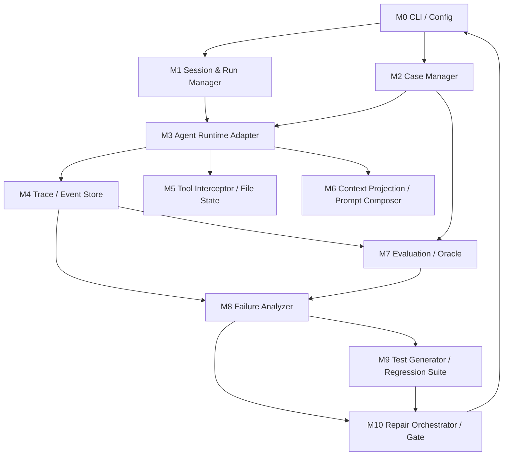

# Agent 自优化系统模块划分

## 1. 划分原则

模块边界按“可以独立开发、可以独立测试、接口稳定”来切。

核心原则：

- `session_id` 是所有模块共享的一级索引。
- `case_run_id` 是一次执行的证据索引。
- 模块之间通过结构化文件、Python API 或事件对象通信，不直接互相读内部状态。
- 早期优先保证端到端链路闭合，后续再增强分析和自动修复能力。

推荐先拆成 8 个核心模块和 2 个支撑模块。

## 2. 模块总览



## 3. 推荐责任人划分

| 模块 | 建议 owner | 是否 MVP 必需 | 主要产物 |
| --- | --- | --- | --- |
| M0 CLI / Config | 平台工程 | 是 | 命令行入口、配置加载、路径规范 |
| M1 Session & Run Manager | 平台工程 | 是 | session/run 生命周期、本地目录管理 |
| M2 Case Manager | 测试平台 | 是 | case schema、case loader、fixture 管理 |
| M3 Agent Runtime Adapter | Agent 工程 | 是 | pygent/tane 风格 Agent 接入、多轮执行 |
| M4 Trace / Event Store | 基础架构 | 是 | events.jsonl、messages.jsonl、trace schema |
| M5 Tool Interceptor / File State | 工具平台 | 是 | 工具调用拦截、文件状态、读去重 |
| M6 Context Projection / Prompt Composer | Agent 工程 | 第二阶段 | prompt 拼接、上下文投影、压缩 |
| M7 Evaluation / Oracle | 测试平台 | 是 | case 断言、metrics、verdict |
| M8 Failure Analyzer | Agent 评估 | 第二阶段 | failure taxonomy、analysis.json |
| M9 Test Generator / Regression Suite | 测试平台 | 第二阶段 | UT/ST 生成、回归套件管理 |
| M10 Repair Orchestrator / Gate | 自动修复 | 第三阶段 | repair plan、patch flow、gate result |

如果人手较少，可以合并为 5 个责任组：

| 责任组 | 包含模块 |
| --- | --- |
| 平台组 | M0 + M1 + M4 |
| Agent 运行组 | M3 + M6 |
| 工具组 | M5 |
| 评测组 | M2 + M7 + M9 |
| 自优化组 | M8 + M10 |

## 4. M0 CLI / Config

### 职责

提供统一入口，让其他模块不需要关心命令行、配置文件和路径解析。

### 需要支持的命令

```bash
lora session create --case <case_id>
lora session show <session_id>
lora case run <case_file>
lora case run <case_file> --session <session_id>
lora case analyze <session_id> <case_run_id>
lora case replay <session_id> <case_run_id>
lora regression run
lora optimize <case_file>
```

### 输入

- CLI 参数
- `lora.yaml`
- 环境变量

### 输出

- 调用其他模块 API
- 标准化后的 `RunConfig`

### 对外接口

```python
class RunConfig:
    workspace_root: str
    lora_root: str
    session_id: str | None
    case_file: str | None
    model: str | None
    max_steps: int
```

### 验收标准

- 所有路径都能解析成绝对路径。
- 不同命令不会绕过 Session/Run Manager。
- CLI 失败时能输出可读错误信息。

## 5. M1 Session & Run Manager

### 职责

管理 `session_id`、`case_run_id`、本地目录结构和 session 生命周期。

### 核心能力

- 创建 session。
- 恢复 session。
- fork session。
- 创建 case run。
- 记录 session metadata。
- 兼容 pygent `Session.load/save`。
- 提供 `.lora/sessions/{session_id}` 结构。

### 输入

- `CaseDefinition.session`
- `RunConfig`
- workspace root

### 输出

- `SessionRef`
- `CaseRunRef`
- 本地目录路径

### 对外接口

```python
class SessionManager:
    def create(self, case_id: str, mode: str = "e2e") -> SessionRef: ...
    def load(self, session_id: str) -> AgentSession: ...
    def load_or_create(self, spec: SessionSpec) -> AgentSession: ...
    def fork(self, source_session_id: str) -> SessionRef: ...
    def start_case_run(self, session_id: str, case_id: str) -> CaseRunRef: ...
    def finish_case_run(self, case_run_ref: CaseRunRef, status: str) -> None: ...
```

### 数据产物

```text
.lora/sessions/{session_id}/metadata.json
.lora/sessions/{session_id}/session.json
.lora/sessions/{session_id}/cases/{case_id}/runs/{case_run_id}/run_config.json
```

### 验收标准

- 同一个 `session_id` 可多次恢复。
- 同一 session 下多次 run 不覆盖数据。
- `case_run_id` 全局或 session 内唯一。

## 6. M2 Case Manager

### 职责

定义、加载、校验 case，并准备运行环境。

### 核心能力

- 解析 `case.yaml`。
- 校验 case schema。
- 管理 fixtures。
- 准备 workspace。
- 生成 case hash。
- 输出标准 `CaseDefinition`。

### 输入

- `cases/*.yaml`
- fixtures

### 输出

- `CaseDefinition`
- `CaseInput`
- `ExpectedBehavior`

### 对外接口

```python
class CaseManager:
    def load(self, path: str) -> CaseDefinition: ...
    def validate(self, case: CaseDefinition) -> None: ...
    def prepare_workspace(self, case: CaseDefinition, case_run_ref: CaseRunRef) -> WorkspaceRef: ...
```

### 验收标准

- case 文件错误能提前报出。
- fixture 准备过程可重复执行。
- case hash 在内容不变时稳定。

## 7. M3 Agent Runtime Adapter

### 职责

把具体 Agent 实现接入统一 runner。它负责多轮对话执行，但不负责分析失败。

### 参考实现

参考 `E:\Projects\example\src\tane\tane.py`：

- `Session.load(workspace_root, session_id)`
- `session.context.add_message(UserMessage(...))`
- `agent.stream(session.context, max_steps=...)`
- `session.save()`

正式实现必须去掉固定 `"default"` session 的写法，真实使用传入的 `session_id`。

### 核心能力

- 加载 session context。
- 追加用户消息。
- 运行 Agent stream。
- 捕获 assistant/tool/chunk 消息。
- 将消息交给 Trace Recorder。
- 执行完成后保存 session。

### 输入

- `AgentSession`
- `CaseDefinition`
- `RunConfig`
- tools

### 输出

- `CaseRunResult`
- 增量更新后的 session
- 消息事件

### 对外接口

```python
class AgentRuntimeAdapter:
    async def run_case(
        self,
        session: AgentSession,
        case: CaseDefinition,
        case_run_ref: CaseRunRef,
    ) -> CaseRunResult: ...
```

### 验收标准

- 支持新 session 和 resume session。
- 每次用户输入都能追加到历史。
- Agent 中途失败也能保留已产生 trace。

## 8. M4 Trace / Event Store

### 职责

作为系统事实来源，记录所有行为证据。

### 核心能力

- 追加事件。
- 读取事件。
- 按 session/case/run/turn 查询。
- 输出 JSONL。
- 支持 replay 所需的顺序读取。

### 输入

- Runtime 消息
- Tool Interceptor 事件
- Prompt 事件
- Evaluation 事件
- Repair 事件

### 输出

```text
events.jsonl
messages.jsonl
tool_calls.jsonl
tool_results.jsonl
file_events.jsonl
```

### 对外接口

```python
class EventStore:
    def append(self, event: ContextEvent) -> str: ...
    def list_by_run(self, session_id: str, case_run_id: str) -> list[ContextEvent]: ...
    def iter_jsonl(self, path: str): ...
```

### 验收标准

- 事件 append-only。
- 每条事件有 `session_id` 和 `case_run_id`。
- 异常场景也能记录 `error` 事件。

## 9. M5 Tool Interceptor / File State

### 职责

统一包装工具调用，记录工具行为和文件状态。

### 核心能力

- 调用前记录 `tool.call`。
- 调用后记录 `tool.result`。
- 捕获异常。
- 识别文件读写。
- 维护 `file_state.json` 和 `read_state.json`。
- 实现重复读取检测。

### 输入

- tool name
- tool args
- real tool callable
- session/case/run context

### 输出

- tool result
- tool events
- file events
- file state update

### 对外接口

```python
class ToolInterceptor:
    def call_tool(self, name: str, args: dict, ctx: ToolContext) -> ToolResult: ...

class FileStateTracker:
    def record_read(self, path: str, content_hash: str, read_range: ReadRange) -> None: ...
    def should_stub_read(self, path: str, content_hash: str, read_range: ReadRange) -> ReadDedupDecision: ...
```

### 验收标准

- 工具成功和失败都能记录。
- 文件 hash 变化后不会错误复用旧 read range。
- 命中重复读取时返回固定 stub。

## 10. M6 Context Projection / Prompt Composer

### 职责

根据 session history、events、file state 和 prompt modules 生成模型可见上下文。

### 核心能力

- prompt 模块注册。
- 动态 prompt 拼接。
- 保存 rendered prompt。
- 长上下文投影/压缩。
- 从历史事件重建当前上下文视图。

### 输入

- session history
- events
- file state
- prompt modules
- case metadata

### 输出

- rendered prompt
- projection object
- compacted context

### 对外接口

```python
class PromptComposer:
    def render(self, ctx: PromptContext) -> RenderedPrompt: ...

class ContextProjector:
    def project(self, session_id: str, event_offset: int | None = None) -> ContextProjection: ...
```

### 验收标准

- prompt 渲染结果可落盘。
- 相同输入产生稳定 prompt。
- projection 不删除原始 events/history。

## 11. M7 Evaluation / Oracle

### 职责

判断一次 case run 是否通过，并输出 metrics/verdict。

### 核心能力

- 检查最终回答。
- 检查工具调用序列。
- 检查文件是否变更。
- 检查最大轮数、最大工具调用数、token 预算。
- 支持 deterministic assertions。
- 后续支持 LLM judge。

### 输入

- `CaseDefinition.expect`
- `events.jsonl`
- final answer
- workspace diff

### 输出

```text
metrics.json
verdict.json
```

### 对外接口

```python
class Evaluator:
    def evaluate(self, case: CaseDefinition, case_run_ref: CaseRunRef) -> EvaluationResult: ...
```

### 验收标准

- 明确区分 pass/fail/error。
- verdict 中给出失败断言。
- evaluator 本身有 UT。

## 12. M8 Failure Analyzer

### 职责

基于 trace 和 verdict 分析失败原因，输出结构化 `analysis.json`。

### 核心能力

- 失败分类。
- 证据抽取。
- 定位疑似模块。
- 生成修复建议。
- 生成测试建议。

### 输入

- case
- verdict
- events
- rendered prompts
- file state
- workspace diff

### 输出

```text
analysis.json
```

### 对外接口

```python
class FailureAnalyzer:
    def analyze(self, case_run_ref: CaseRunRef) -> AnalysisResult: ...
```

### 验收标准

- 输出 root cause 类型。
- 每个 root cause 至少有一条 evidence。
- 输出 machine-readable JSON。

## 13. M9 Test Generator / Regression Suite

### 职责

根据 analysis 产出 UT/ST 建议或测试文件，并维护 regression suite。

### 核心能力

- 生成 UT skeleton。
- 生成 scenario test。
- 注册 regression case。
- 运行指定 case 集合。
- 对比历史结果。

### 输入

- `analysis.json`
- case
- target modules

### 输出

- test files
- regression manifest
- test run result

### 对外接口

```python
class TestGenerator:
    def generate(self, analysis: AnalysisResult) -> GeneratedTests: ...

class RegressionSuite:
    def run(self, selector: RegressionSelector) -> RegressionResult: ...
```

### 验收标准

- 生成的测试不会覆盖已有测试。
- regression manifest 可重复执行。
- 失败测试能映射回 case/session。

## 14. M10 Repair Orchestrator / Gate

### 职责

组织自动或半自动修复，并用 gate 决定是否接受。

### 核心能力

- 读取 analysis。
- 生成 repair plan。
- 调用 patch agent 或人工 patch。
- 跑新增 UT。
- 跑相关 ST。
- replay 原失败 case。
- 跑 regression suite。
- 输出 gate result。

### 输入

- analysis
- generated tests
- current git diff
- allowed modules

### 输出

```text
repair_plan.json
patch.diff
test_results.json
gate_result.json
```

### 对外接口

```python
class RepairOrchestrator:
    def plan(self, analysis: AnalysisResult) -> RepairPlan: ...
    def apply(self, plan: RepairPlan) -> RepairAttempt: ...
    def gate(self, attempt: RepairAttempt) -> GateResult: ...
```

### 验收标准

- gate 不通过时不标记 accepted。
- 每次 repair attempt 独立保存。
- 能回放原失败 case。

## 15. 模块依赖顺序

推荐开发顺序：

```text
M0 CLI / Config
  -> M1 Session & Run Manager
  -> M2 Case Manager
  -> M4 Trace / Event Store
  -> M3 Agent Runtime Adapter
  -> M7 Evaluation / Oracle
  -> M5 Tool Interceptor / File State
  -> M6 Context Projection / Prompt Composer
  -> M8 Failure Analyzer
  -> M9 Test Generator / Regression Suite
  -> M10 Repair Orchestrator / Gate
```

可以并行开发：

- M1 和 M2 可以并行，只要先约定 `SessionSpec` 和 `CaseDefinition`。
- M3 和 M4 可以并行，只要先约定 `ContextEvent`。
- M5 可以在 M4 之后独立开发。
- M7 可以在 M2/M4 之后独立开发。
- M8/M9/M10 必须等 M4/M7 的数据稳定后再开发。

## 16. 跨模块公共模型

这些模型必须先冻结第一版，否则团队之间会互相卡住。

```python
class SessionRef:
    session_id: str
    session_dir: str
    workspace_root: str

class CaseRunRef:
    session_id: str
    case_id: str
    case_run_id: str
    run_dir: str

class ContextEvent:
    id: str
    session_id: str
    case_id: str | None
    case_run_id: str | None
    turn_id: str | None
    type: str
    timestamp: str
    actor: str
    payload: dict

class CaseDefinition:
    id: str
    title: str
    type: str
    session: dict
    workspace: dict
    input: dict
    expect: dict
    metrics: dict
```

建议由平台组维护 `src/lora/schema/`，所有模块只依赖这些公共模型。

## 17. MVP 模块边界

第一版最小闭环只需要：

1. M0 CLI / Config
2. M1 Session & Run Manager
3. M2 Case Manager
4. M3 Agent Runtime Adapter
5. M4 Trace / Event Store
6. M7 Evaluation / Oracle

第一版可以暂缓：

- M6 的复杂压缩，只保存 rendered prompt。
- M8 的 LLM 分析，先做规则分析。
- M9 的自动测试生成，先输出测试建议。
- M10 的自动 patch，先只做人工 patch + regression gate。

MVP 完成标准：

```text
给定一个 case.yaml
  -> 创建 session_id
  -> 运行 Agent 多轮对话
  -> 保存 session.json 和 events.jsonl
  -> 生成 metrics/verdict
  -> 能用同一个 session_id resume 或 replay
```

