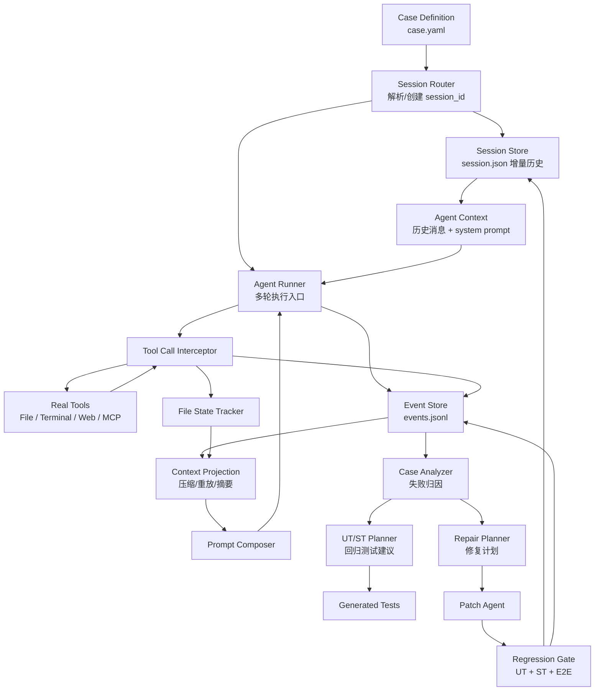

# Agent 自优化系统：Session 化 Case 驱动设计

## 1. 设计目标

这个系统的目标不是只运行一个 Agent，而是建立一个可以持续优化 Agent harness、工具设计、上下文管理和回归测试的闭环。

核心思想：

- 所有端到端 case 都通过 `session_id` 管理。
- 一个 `session_id` 对应一次可持续、多轮、可恢复的 Agent 工作上下文。
- 每轮对话只做增量追加，历史上下文保存在本地文件。
- 每个 case 的运行日志、工具调用、文件读写、prompt 渲染、失败分析、生成测试和修复结果都挂在同一个 session 下。
- 每次修复必须通过 UT/ST/regression gate 才能进入下一轮优化。

参考 `E:\Projects\example\src\tane\tane.py` 的多轮对话模式：

- 使用 `Session.load(workspace_root, session_id)` 恢复历史上下文。
- 将新的 `UserMessage` 追加到 `session.context`。
- Agent 执行过程中将 assistant/tool 消息继续追加到同一个 context。
- 一轮执行完成后调用 `session.save()`，把增量后的历史写回本地。

`pygent.session.Session` 当前落盘路径是：

```text
{workspace_root}/sessions/{session_id}/session.json
```

文件内包含：

- `session_id`
- `workspace_root`
- `created_at`
- `updated_at`
- `system_prompt`
- `history`
- `metadata`

这个机制可以作为本系统最小可行版本的 session 持久化层，但正式系统需要在它外面补充 case/run/event/analysis/test/repair 的结构化记录。

## 2. 总体架构



系统分为五层：

| 层 | 职责 |
| --- | --- |
| Session 层 | 用 `session_id` 管理多轮上下文和本地历史。 |
| Case 层 | 定义输入、预期行为、评估标准和复现环境。 |
| Trace 层 | 记录 Agent 实际行为，包括 prompt、消息、工具、文件和测试。 |
| Analysis 层 | 根据 trace 分析失败原因，定位工具或设计问题。 |
| Repair 层 | 修改代码、生成回归测试，并通过 gate 验证。 |

## 3. Session ID 设计

### 3.1 session_id 的职责

`session_id` 是系统的一级组织键。它不只是聊天会话 id，还承担以下职责：

- 绑定一个或多个 case 的连续运行历史。
- 绑定 Agent 的多轮对话上下文。
- 绑定工具读写状态、文件状态和 prompt 渲染历史。
- 绑定失败分析、测试生成和修复记录。
- 支持从任意 session 恢复、继续运行、复盘或回归。

### 3.2 推荐命名规则

`session_id` 应该稳定、可读、可追踪：

```text
{scope}-{case_id}-{yyyyMMdd-HHmmss}-{short_hash}
```

例如：

```text
e2e-read-file-basic-20260527-172312-a18f3c
repair-context-dedup-20260527-174010-b92d1a
```

其中：

- `scope`：`e2e`、`debug`、`repair`、`regression`、`manual`
- `case_id`：case 的稳定 id
- 时间戳：方便排序
- `short_hash`：来自 case 配置、git sha 或 run config 的短 hash

### 3.3 session 与 case/run 的关系

建议关系：

```text
Session 1 ── N CaseRun
Case     1 ── N CaseRun
CaseRun  1 ── 1 Trace
CaseRun  1 ── 0..1 Analysis
CaseRun  1 ── 0..N GeneratedTest
CaseRun  1 ── 0..N RepairAttempt
```

解释：

- 一个 `session_id` 可以包含多轮对话和多个 case run。
- 一个 case 可以在不同 session 下重复运行。
- `case_run_id` 表示某次具体执行，用于避免同一 session 下多次运行互相覆盖。
- session 保存“连续上下文”，run 保存“单次执行证据”。

## 4. 本地目录结构

建议将正式系统的数据目录从普通 `sessions/` 扩展为 `.lora/sessions/`。如果需要兼容 pygent 的 `Session`，可以在 MVP 阶段继续保存到 `{workspace_root}/sessions/{session_id}/session.json`，同时将结构化 trace 保存到 `.lora/sessions/{session_id}`。

推荐结构：

```text
.lora/
  sessions/
    {session_id}/
      session.json
      metadata.json
      context/
        history.jsonl
        compacted.json
        projections/
          {projection_id}.json
      cases/
        {case_id}/
          runs/
            {case_run_id}/
              case.yaml
              run_config.json
              events.jsonl
              messages.jsonl
              tool_calls.jsonl
              tool_results.jsonl
              file_events.jsonl
              rendered_prompts/
                turn-{turn_id}.txt
                turn-{turn_id}.json
              workspace/
                before.patch
                after.patch
                diff.patch
              metrics.json
              verdict.json
              analysis.json
              generated_tests/
                manifest.json
                unit/
                scenario/
              repair/
                attempts/
                  {repair_attempt_id}/
                    repair_plan.json
                    patch.diff
                    test_results.json
                    gate_result.json
      state/
        file_state.json
        read_state.json
        prompt_registry_snapshot.json
        version_refs.json
      logs/
        session-events.jsonl
```

### 4.1 session.json

`session.json` 保存 Agent 可直接恢复的对话上下文，类似 pygent 的 `Session.save()`。

示例：

```json
{
  "version": "1.0",
  "session_id": "e2e-read-file-basic-20260527-172312-a18f3c",
  "workspace_root": "E:/Projects/lora",
  "created_at": "2026-05-27T17:23:12",
  "updated_at": "2026-05-27T17:25:41",
  "system_prompt": "You are a coding agent...",
  "history": [],
  "metadata": {
    "active_case_id": "read-file-basic",
    "last_case_run_id": "run-0003",
    "git_sha": "..."
  }
}
```

### 4.2 history.jsonl

`history.jsonl` 是增量消息日志。相比每次重写完整 `session.json`，它更适合审计、diff 和恢复。

每行一条消息事件：

```json
{"seq":1,"turn_id":"turn-0001","role":"user","content":"请读取 README","created_at":"..."}
{"seq":2,"turn_id":"turn-0001","role":"assistant","content":"我会先查看文件。","created_at":"..."}
{"seq":3,"turn_id":"turn-0001","role":"tool","tool_call_id":"call_x","content":"...","created_at":"..."}
```

MVP 可以先只写 `session.json`，但正式版本建议同时写：

- `session.json`：快速恢复。
- `history.jsonl`：增量审计。
- `events.jsonl`：完整系统事实来源。

## 5. Case 定义

每个 case 用 YAML 定义。case 本身不直接等于 session，它只描述任务和验收标准。

示例：

```yaml
id: read-file-basic
title: 读取文件并总结
type: e2e

session:
  mode: new
  id_template: "e2e-{case_id}-{timestamp}-{config_hash}"
  carry_context: false

workspace:
  root: "E:/Projects/lora"
  setup:
    - type: copy_fixture
      from: "fixtures/read-file-basic"
      to: ".tmp/cases/read-file-basic"

input:
  messages:
    - role: user
      content: "请读取 examples/react_agent_demo.py，并总结里面注册了哪些工具。"

expect:
  tool_calls:
    required:
      - name: read_text_file
  answer:
    contains:
      - "list_files"
      - "read_text_file"
      - "add_numbers"
  files:
    unchanged:
      - "examples/react_agent_demo.py"

metrics:
  max_turns: 8
  max_tool_calls: 6
  max_context_tokens: 30000
```

### 5.1 session.mode

`session.mode` 控制 case 如何使用上下文：

| mode | 行为 | 适用场景 |
| --- | --- | --- |
| `new` | 创建新 session。 | 大多数 E2E case。 |
| `resume` | 从指定 session 继续。 | 多轮对话、长期任务。 |
| `fork` | 从已有 session 复制出新 session。 | 对比实验、修复验证。 |
| `shared` | 多个 case 共享一个 session。 | 长链路任务。 |

### 5.2 carry_context

`carry_context` 表示 case 是否允许继承历史上下文：

- `false`：只保留系统 prompt 和 case 输入，适合确定性回归。
- `true`：加载历史消息，适合验证多轮对话和长期记忆。

## 6. Agent Runner 设计

Agent Runner 是正式系统的执行入口。它需要把 `tane.py` 里的 session 模式标准化。

伪代码：

```python
class AgentRunner:
    def run_case(self, case: CaseDefinition) -> CaseRunResult:
        session_ref = self.session_router.resolve(case.session)
        session = self.session_store.load_or_create(session_ref)

        case_run = self.case_run_store.start(case, session.session_id)
        context = session.context

        for message in case.input.messages:
            context.add_message(to_pygent_message(message))
            self.event_store.append_user_message(case_run, message)
            self.history_store.append(session.session_id, message)

        async for output in self.agent.stream(context):
            self.trace_recorder.record(output)
            self.history_store.append_if_message(session.session_id, output)

        session.save()
        self.case_run_store.finish(case_run)
        return self.evaluator.evaluate(case_run)
```

和 `tane.py` 的差异：

- 不应该固定加载 `"default"` session。
- session_id 必须来自 case 或 SessionRouter。
- 每个 tool call/result 都必须通过 Interceptor 记录。
- `session.save()` 之外还要写结构化 trace。
- 每次 case run 必须有独立 `case_run_id`。

## 7. 多轮对话与上下文增量保存

### 7.1 写入时机

每轮对话建议采用四个写入点：

1. 收到用户输入后，立即追加 `user_message`。
2. 模型产生 assistant 消息后，追加 `assistant_message`。
3. 工具调用前后，追加 `tool.call` 和 `tool.result`。
4. 一轮完成后，保存 `session.json` 和 `session checkpoint`。

这样即使中途失败，也能保留足够上下文用于复盘。

### 7.2 checkpoint

每个 turn 完成后生成 checkpoint：

```text
.lora/sessions/{session_id}/context/checkpoints/{turn_id}.json
```

内容：

- 当前消息数量
- 当前 token 估算
- 最近一次 prompt projection id
- 文件状态 hash
- event offset
- case_run_id

checkpoint 用于：

- 从某一轮恢复。
- 对比压缩前后的上下文。
- 分析某次失败前 Agent 到底知道什么。

### 7.3 context compaction

当历史过长时，不直接删除原始历史，而是生成投影：

```text
原始 events/history -> projection -> compacted context
```

投影结果写入：

```text
.lora/sessions/{session_id}/context/projections/{projection_id}.json
```

`session.json` 可以保存当前压缩后的可执行上下文；原始 `history.jsonl` 和 `events.jsonl` 始终保留。

## 8. Trace/Event 设计

`events.jsonl` 是 case run 的事实来源。所有分析、测试生成和修复都应优先读它。

基础事件：

```json
{
  "id": "evt_...",
  "session_id": "e2e-read-file-basic-...",
  "case_id": "read-file-basic",
  "case_run_id": "run-0001",
  "turn_id": "turn-0001",
  "type": "tool.result",
  "timestamp": "2026-05-27T17:23:45.123",
  "actor": "tool",
  "payload": {}
}
```

必备事件类型：

- `case.started`
- `case.finished`
- `conversation.user_message`
- `conversation.assistant_message`
- `conversation.tool_message`
- `model.request`
- `model.response`
- `prompt.rendered`
- `tool.call`
- `tool.result`
- `file.read`
- `file.write`
- `file.edit`
- `file.delete`
- `context.checkpoint`
- `context.projection_created`
- `analysis.created`
- `test.generated`
- `repair.started`
- `repair.patch_created`
- `repair.finished`
- `regression.started`
- `regression.finished`

## 9. 工具拦截与文件状态

所有工具都必须由 `ToolCallInterceptor` 包装。

职责：

- 记录工具名称、参数、开始/结束时间。
- 捕获返回值、异常、状态码。
- 识别文件读写 side effects。
- 记录文件前后 hash。
- 更新 `FileStateTracker`。
- 实现重复读取检测。

重复读取检测沿用现有设计：

- 路径规范化一致。
- 文件内容 hash 一致。
- 请求范围被历史读取范围覆盖。
- 命中后返回固定 stub，而不是重复塞入完整内容。

固定 stub：

```text
File unchanged since last read. The content from the earlier Read tool_result in this conversation is still current. Refer to that instead of re-reading.
```

## 10. 分析与测试生成

Analyzer 输入：

- `case.yaml`
- `events.jsonl`
- `session.json`
- `history.jsonl`
- `rendered_prompts/`
- `file_state.json`
- `metrics.json`
- `verdict.json`

Analyzer 输出：

```json
{
  "session_id": "e2e-read-file-basic-...",
  "case_id": "read-file-basic",
  "case_run_id": "run-0001",
  "status": "failed",
  "root_causes": [
    {
      "type": "CONTEXT_MISSING",
      "summary": "Agent 在回答前没有读取包含工具注册处的代码范围。",
      "evidence": [
        "read_text_file returned truncated=true",
        "final answer missed add_numbers"
      ],
      "suspected_modules": [
        "runtime/agent_runner.py",
        "store/file_state_tracker.py"
      ],
      "recommended_tests": [
        {
          "kind": "scenario",
          "description": "当读取结果被截断时，Agent 应继续读取缺失范围再回答。"
        }
      ]
    }
  ]
}
```

失败分类：

| 类型 | 含义 |
| --- | --- |
| `TOOL_SCHEMA_ERROR` | 工具 schema 或参数映射错误。 |
| `TOOL_EXECUTION_ERROR` | 工具执行失败。 |
| `CONTEXT_MISSING` | 关键信息没有进入上下文。 |
| `CONTEXT_POLLUTION` | 上下文重复、过长或无关内容过多。 |
| `PROMPT_AMBIGUITY` | prompt 规则不清。 |
| `PLANNING_ERROR` | Agent 步骤选择错误。 |
| `ASSERTION_FAILED` | 输出不满足 case oracle。 |
| `NON_DETERMINISTIC` | 多次运行不稳定。 |
| `REGRESSION` | 以前通过，现在失败。 |

## 11. Repair 与 Regression Gate

Repair 阶段不能只让 Agent 自由改代码，必须受分析结果和测试约束。

输入：

- 失败 case
- trace
- root cause
- 建议测试
- 当前 git diff
- 可修改模块范围
- 必须通过的 regression list

输出：

- `repair_plan.json`
- `patch.diff`
- 新增或修改的 UT/ST
- `test_results.json`
- `gate_result.json`

Regression Gate 顺序：

1. 运行新增 UT。
2. 运行相关 ST。
3. replay 原失败 case。
4. 运行核心 regression suite。
5. 对比 metrics，拒绝明显退化。

只有 gate 通过，修复才进入 accepted 状态。

## 12. CLI 设计

建议 CLI：

```bash
lora session create --case read-file-basic
lora session list
lora session show <session_id>
lora session resume <session_id>

lora case run cases/read-file-basic.yaml
lora case run cases/read-file-basic.yaml --session <session_id>
lora case analyze <session_id> <case_run_id>
lora case replay <session_id> <case_run_id>

lora repair plan <session_id> <case_run_id>
lora repair apply <session_id> <case_run_id>
lora regression run --session <session_id>

lora optimize cases/read-file-basic.yaml
```

`lora optimize` 是组合命令：

```text
run case -> evaluate -> analyze if failed -> generate tests -> repair -> regression gate
```

## 13. MVP 落地顺序

第一阶段：Session 化运行

- 实现 `SessionRouter`。
- 支持 case 指定 `session_id`。
- 兼容 pygent `Session.load/save`。
- 修正类似 `tane.py` 中固定加载 `"default"` 的做法，改为真实传入 session id。
- 每次运行生成 `case_run_id`。

第二阶段：Trace 完整化

- 实现 `events.jsonl`。
- 实现 `messages.jsonl`。
- 实现工具调用拦截记录。
- 保存 rendered prompt。
- 保存 metrics/verdict。

第三阶段：Case + ST

- 定义 `case.yaml` schema。
- 实现 case runner。
- 实现 oracle/assertion。
- 加入 scenario tests。

第四阶段：Analyzer

- 先做 rule-based analyzer。
- 再接入 LLM 做自然语言解释和测试建议。
- 输出结构化 `analysis.json`。

第五阶段：Repair Gate

- 根据 analysis 生成修复计划。
- 自动或半自动修改代码。
- 生成 UT/ST。
- 跑 regression gate。

## 14. 关键设计原则

1. `session_id` 管连续上下文，`case_run_id` 管单次执行证据。
2. `session.json` 用于快速恢复，`events.jsonl` 用于事实审计。
3. 历史只增量追加，不覆盖证据。
4. 压缩是 projection，不是删除原始日志。
5. Analyzer 必须输出结构化 root cause。
6. Repair 必须受测试和 gate 约束。
7. Case 要尽量确定性，长期多轮任务才共享 session。
8. Agent 自优化的最小闭环是：失败可复现、原因可定位、测试可回归、修复可验证。

