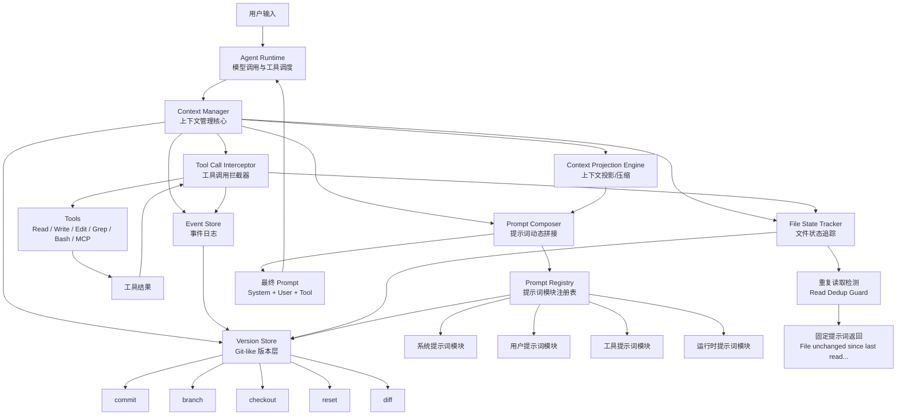
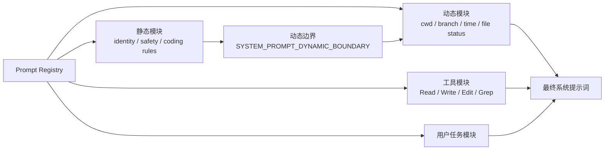
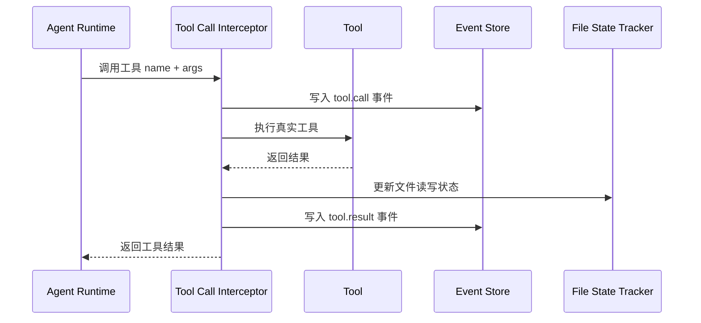
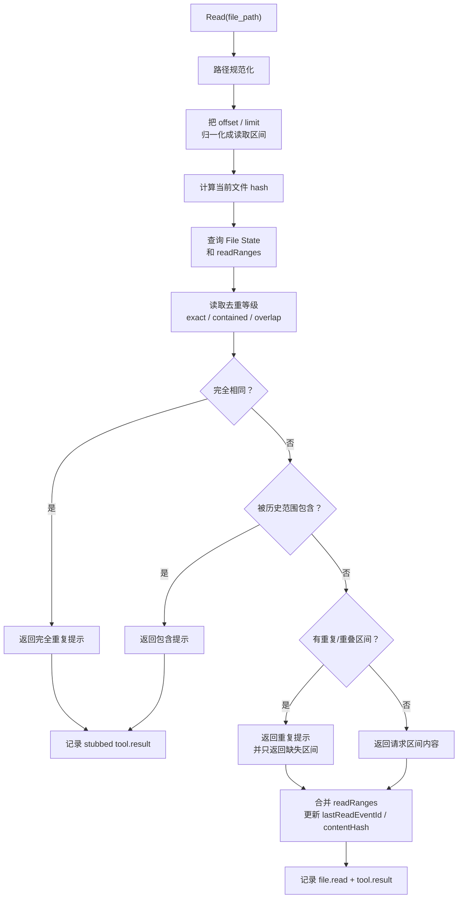
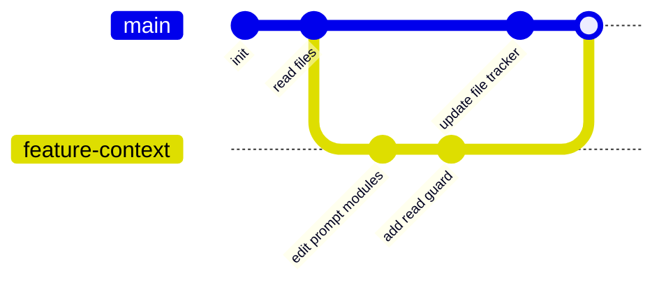

# Agent 上下文管理系统架构图

## 总览架构



## 核心思路

这套系统的中心是 `Context Manager`。它不直接等同于聊天历史，而是一个负责记录、索引、投影和版本化的上下文内核。所有用户消息、模型回复、工具调用、工具结果、文件读写、提示词渲染结果，都会先变成标准事件，再写入 `Event Store`。

`Event Store` 是 append-only 的事件日志，相当于系统的事实来源。它记录“发生过什么”，但不负责解释当前状态。当前状态由 `Context Projection Engine` 和 `File State Tracker` 从事件中计算出来。

`Version Store` 是 Git-like 层。它把一段事件日志、文件状态快照、提示词模块版本、上下文投影元数据打包成一次 `commit`。之后可以基于 commit 新建分支、切换分支、比较差异、回退状态。

## 提示词模块化



提示词不应该维护成一个巨大的字符串，而应该拆成多个模块。每个模块有自己的 `id`、类型、顺序、缓存范围和渲染函数。

静态模块适合长期缓存，比如身份设定、基础安全规则、代码风格规则。动态模块每轮重新计算，比如当前分支、当前时间、文件状态、最近工具结果。这里可以参考 `prompt-injection-map.md` 里的做法，用一个动态边界把可缓存内容和会话相关内容分开。

## 工具调用记录



所有工具都经过 `Tool Call Interceptor`。它的职责是把工具调用变成可审计、可回放、可 diff 的事件。

记录内容包括工具名、入参、开始时间、结束时间、结果、错误、涉及的文件路径、文件前后 hash，以及这次调用属于哪一轮模型交互。

## 文件读取去重



这个能力可以显著减少上下文污染。判断条件不能只看路径，也不能只看整个文件 hash。文件 hash 只能证明“文件版本没变”，但不能证明“这次请求的读取范围已经进过上下文”。因此需要在 `File State` 里维护 `readRanges`，记录每次读取的行区间或字节区间。

读取去重策略可以设置三个等级：

| 等级 | 触发条件 | 例子 | 行为 |
| --- | --- | --- | --- |
| `exact` 完全相同才提示 | 路径一致、文件 hash 一致、读取区间完全一致。 | 之前读 `50-80`，现在又读 `50-80`。 | 返回“完全重复读取”提示。 |
| `contained` 包含时提示 | 路径一致、文件 hash 一致、历史读取区间完整包含新请求区间。 | 之前读 `1-200`，现在读 `50-80`。 | 返回“已被之前读取范围包含”提示。 |
| `overlap` 重复时提示 | 路径一致、文件 hash 一致、新请求区间和历史区间存在任意交集。 | 之前读 `1-200`，现在读 `150-260`。 | 提示部分重复，并只返回未读的 `201-260`。 |

`contained` 包含 `exact` 的场景，`overlap` 又包含 `contained` 和 `exact` 的场景。也就是说，从上到下越来越严格，也越来越节省上下文。

例如：

- 之前读过整个文件，现在读取第 20-40 行，可以直接返回固定提示。
- 之前读过第 1-200 行，现在读取第 50-80 行，可以直接返回固定提示。
- 之前读过第 1-200 行，现在读取第 150-260 行，可以只返回第 201-260 行，或者提示前半段已读、后半段需要读取。
- 如果文件 hash 已经变化，即使路径和范围一样，也必须重新返回内容，因为旧范围对应的是旧文件版本。

当读取区间已被覆盖时，返回固定提示：

```text
File unchanged since last read. The content from the earlier Read tool_result in this conversation is still current. Refer to that instead of re-reading.
```

完整判断条件应当是：规范化路径一致、文件内容 hash 一致、请求区间和历史读取区间满足当前去重等级。这个组合既可以覆盖“大范围读过后再次小范围读取”的情况，也可以覆盖“部分重复读取”的情况。

## Git-like 版本管理



每次 `commit` 保存的不是单纯聊天记录，而是一个完整上下文快照：

- 一组事件 id
- 当前文件状态树
- 当前提示词模块版本
- 当前上下文投影信息
- 当前分支、工作目录、模型元数据

这样做的好处是，回退时不只是回退对话，还可以回退“agent 认为自己读过什么文件”“哪些工具结果已经进入上下文”“当前提示词由哪些模块组成”等运行时状态。

## 最终能力闭环

最终版系统应当把上下文、工具、文件和提示词统一纳入同一个可版本化状态空间，而不是只管理聊天记录。

完整能力包括：

- 记录用户消息、模型回复、工具调用、工具结果、系统提醒和提示词渲染结果。
- 记录文件读取、写入、编辑、删除、快照和内容 hash。
- 维护每个分支下的文件状态、已读状态、写入状态和上下文引用状态。
- 支持 `status`、`commit`、`branch`、`checkout`、`reset`、`merge`、`diff`、`log`、`show` 等 Git-like 操作。
- 支持 `context-only checkout` 和 `workspace checkout` 两种切换方式，前者只恢复 agent 上下文状态，后者同时恢复真实工作区文件。
- 支持提示词模块注册、版本锁定、动态拼接、渲染记录和提示词 diff。
- 支持工具提示词按需加载，工具 schema 可以从完整加载、延迟加载或运行时注入三种模式中选择。
- 支持重复文件读取检测，基于文件 hash、已读区间关系和去重等级判断是否返回提示词或只返回缺失区间，避免重复内容污染上下文。
- 支持上下文投影和压缩，把完整事件日志转换成适合模型输入的当前上下文视图。
- 支持审计和回放，可以从任意 commit 重建当时的消息历史、工具结果、文件状态和最终 prompt。

这套闭环的关键点是：`Event Store` 保存事实，`Version Store` 管理历史，`Projection Engine` 生成模型可见上下文，`Prompt Composer` 生成最终输入，`File State Tracker` 保护文件状态一致性。所有模块共同保证 agent 的上下文既能被压缩，又能被追溯、回退和分支化。
