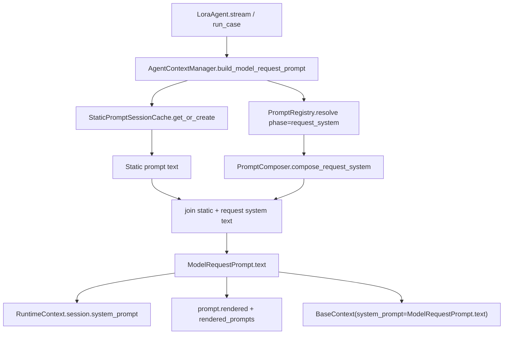

# Prompt Composition Architecture Design

## 1. 目标

本设计描述当前 Lora Agent 真实发送给模型的提示词链路。重构后的核心目标是：

1. 把 session 级稳定内容和每次请求都要重新渲染的 system 内容拆开。
2. 明确哪些内容进入 system prompt、哪些内容进入 user/tool message。
3. 保证所有实际发送给模型的 system prompt 都落盘到 `session.json`、`prompt.rendered` 事件和 rendered prompt 文件。
4. 删除已经不再发送给模型的旧动态模块，避免“渲染了但没发送”的双轨逻辑。

## 2. 模型可见通道

一次模型请求由三类模型可见内容组成：

| 通道 | 来源 | 说明 |
| --- | --- | --- |
| system prompt static prefix | `phase="static"` prompt modules | session 内可缓存，写入 `context/prompts/static_prompt.txt` |
| system prompt request prefix | `phase="request_system"` prompt modules | 每次请求重新渲染，和 static prefix 一起作为真实 system prompt 发送 |
| conversation messages | runtime history | user message、assistant message、tool message，其中 user/tool message 可能追加 `<system-reminder>` |

静态前缀和请求级 system 前缀直接拼成同一个 system prompt 字符串，中间只保留普通空行分隔：

```text
{static prompt}

{request system prompt}
```

发送给底层模型的是完整 `ModelRequestPrompt.text`。不要在真实 prompt 文本中插入额外 marker；审计边界通过 `prompt.rendered` 元数据里的 `static_module_ids` 和 `request_system_module_ids` 表达。

## 3. PromptModule

`PromptModule.phase` 只使用两个值：

```python
Literal["static", "request_system"]
```

字段含义：

| 字段 | 说明 |
| --- | --- |
| `id` | 稳定模块 id，例如 `system.identity`、`tool.available` |
| `phase` | `static` 进入 session 缓存；`request_system` 每次请求渲染并拼到 system prompt |
| `type` | 模块归属：`system`、`policy`、`tool` 等 |
| `cache_scope` | `static` 模块使用 `session`；`request_system` 模块通常使用 `request` 或 `turn` |
| `order` | 拼接顺序 |
| `required` | 必选模块渲染为空时应报错 |
| `render` | 根据 `PromptRenderContext` 渲染文本 |

## 4. 当前默认模块

### Static Modules

| 模块 id | 内容 |
| --- | --- |
| `system.identity` | Agent 身份、职责和语言策略 |
| `system.tool_policy` | 工具调用策略和工具结果信任边界 |
| `system.injection_guard` | 非可信内容与 prompt injection 防护 |
| `system.path_policy` | workspace、project/user Lora root 和工具路径规则 |
| `system.coding_rules` | 编码工作规则 |
| `system.output_style` | 输出风格 |

### Request System Modules

| 模块 id | 内容 |
| --- | --- |
| `tool.available` | 当前实际可用工具名和用途摘要 |
| `system.tool_result_reminders` | 工具结果处理规则 |
| `system.token_budget` | 当前上下文预算或 max steps 说明 |

### 已移除模块

以下模块不再注册，也不再渲染进 system prompt：

| 旧模块 id | 移除原因 |
| --- | --- |
| `runtime.system_reminder` | 改为追加到初始 user message 或新工具结果后的 tool message |
| `runtime.skill_reminder` | 同上，和 CLI context 共用一个 `<system-reminder>` 包装 |
| `runtime.env_info` | 不再作为默认模型提示词发送 |
| `project.file_status` | 不再作为默认模型提示词发送 |
| `memory.recent_projection` | 不再作为默认模型提示词发送 |
| `runtime.tool_result_reminders` | 重命名为 `system.tool_result_reminders` |
| `runtime.token_budget` | 重命名为 `system.token_budget` |

## 5. System Prompt 拼接链路



请求入口只认 `build_model_request_prompt(...)`：

1. 获取或创建 session static prompt。
2. 解析并渲染 `phase="request_system"` 模块。
3. 直接拼出完整 system prompt，不插入额外边界 marker。
4. 把完整文本写入 `runtime_context.system_prompt` 和 `runtime_context.session.system_prompt`。
5. 记录 `prompt.rendered` 事件，并由 `EventStore` 写入 rendered prompt 文件。
6. `LoraAgent.stream()` 把完整 `ModelRequestPrompt.text` 传给底层模型。

## 6. `<system-reminder>` 消息链路

`<system-reminder>` 不属于 system prompt module。它是追加到 conversation message 的运行时提醒，分两种位置：

| 场景 | 注入位置 | 内容 |
| --- | --- | --- |
| session 初始可用 CLI / skill 列表 | 当前 user message 后面 | `<cli-context>`、`<skills-context>` |
| 工具执行后发现新的 CLI / skill | 当前 tool message 后面 | 只包含新发现条目 |

CLI context 和 skill context 始终共用一个外层标签：

```xml
<system-reminder>
  <cli-context>
    ...
  </cli-context>
  <skills-context>
    ...
  </skills-context>
</system-reminder>
```

初始提醒由 `AgentRuntimeAdapter.run_turn()` 和 `run_case()` 在写入 user message 前后统一处理。新发现提醒由工具结果路径在写入 tool message 时追加。两者不再通过 `runtime.system_reminder` 或 `runtime.skill_reminder` 这类 prompt module 实现。

## 7. 落盘与审计

### Static Prompt Cache

```text
.lora/sessions/{session_id}/context/prompts/static_prompt.txt
.lora/sessions/{session_id}/context/prompts/static_prompt.json
```

这里只保存 `phase="static"` 的文本和元数据，不包含 request system modules，也不包含 `<system-reminder>`。

### Rendered Prompt

每次模型请求的完整 system prompt 会写入：

```text
{run_dir}/rendered_prompts/{turn_id}.txt
{run_dir}/rendered_prompts/{turn_id}.json
.lora/sessions/{session_id}/context/rendered_prompts/{case_run_id}/{turn_id}.txt
.lora/sessions/{session_id}/context/rendered_prompts/{case_run_id}/{turn_id}.json
```

`prompt.rendered` payload 包含：

```json
{
  "prompt_hash": "sha256:...",
  "static_prompt_hash": "sha256:...",
  "request_system_prompt_hash": "sha256:...",
  "dynamic_prompt_hash": null,
  "module_ids": [
    "system.identity",
    "tool.available",
    "system.tool_result_reminders",
    "system.token_budget"
  ],
  "static_module_ids": ["system.identity"],
  "request_system_module_ids": [
    "tool.available",
    "system.tool_result_reminders",
    "system.token_budget"
  ],
  "dynamic_module_ids": [],
  "prompt_text_path": ".../rendered_prompts/turn-0001.txt"
}
```

`dynamic_module_ids` 只作为旧字段占位，当前应为空；新逻辑应使用 `request_system_module_ids` 判断请求级 system prompt 的模块组成。

### Session Snapshot

`session.json.system_prompt` 保存最新一次真实发送给模型的完整 system prompt。它包含 static prefix 和 request system prefix，但不包含额外边界 marker。

## 8. 测试要求

单元测试应覆盖：

- static prompt 只包含 `phase="static"` 模块。
- `build_model_request_prompt()` 返回的文本包含 static modules 和 request system modules，但不包含额外边界 marker。
- `runtime_context.session.system_prompt` 等于真实发送给模型的完整 prompt。
- `prompt.rendered` 包含 `request_system_module_ids`，且 `dynamic_module_ids` 为空。
- 初始 skill/CLI reminder 追加到首个 user message，不进入 rendered system prompt。
- 新发现 skill/CLI reminder 追加到对应 tool message，不进入 rendered system prompt。
- 已移除模块不会出现在 registry、rendered prompt 或 session prompt 中。

场景测试应覆盖：

- `lora chat --message` 首轮生成 static prompt，同时 rendered prompt 包含 request system modules。
- 续接同一个 session 时 static prompt 命中缓存，但 request system modules 重新渲染。
- case run 的第一条 user message 能收到初始 skill reminder。
- trace 和 session 落盘文件能读取到 `request_system_module_ids` 和完整 prompt 文本。

## 9. 关键决策

- 不再维护“渲染了但没有发送”的动态 prompt 轨道。
- 模型 system prompt 只有两段：session static prefix 和 request system prefix。
- CLI / skill reminder 属于 conversation message 附加内容，不属于 prompt registry 模块。
- `system.tool_result_reminders`、`system.token_budget` 使用 `system.*` 命名，避免和已移除的 runtime reminder 混淆。
- 所有实际发送给模型的 system 内容必须同时进入 model request、`session.json`、`prompt.rendered` 和 rendered prompt 文件。
