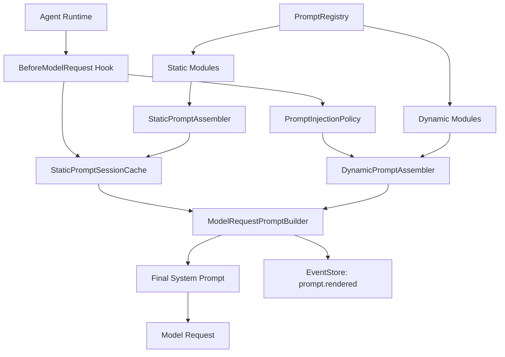
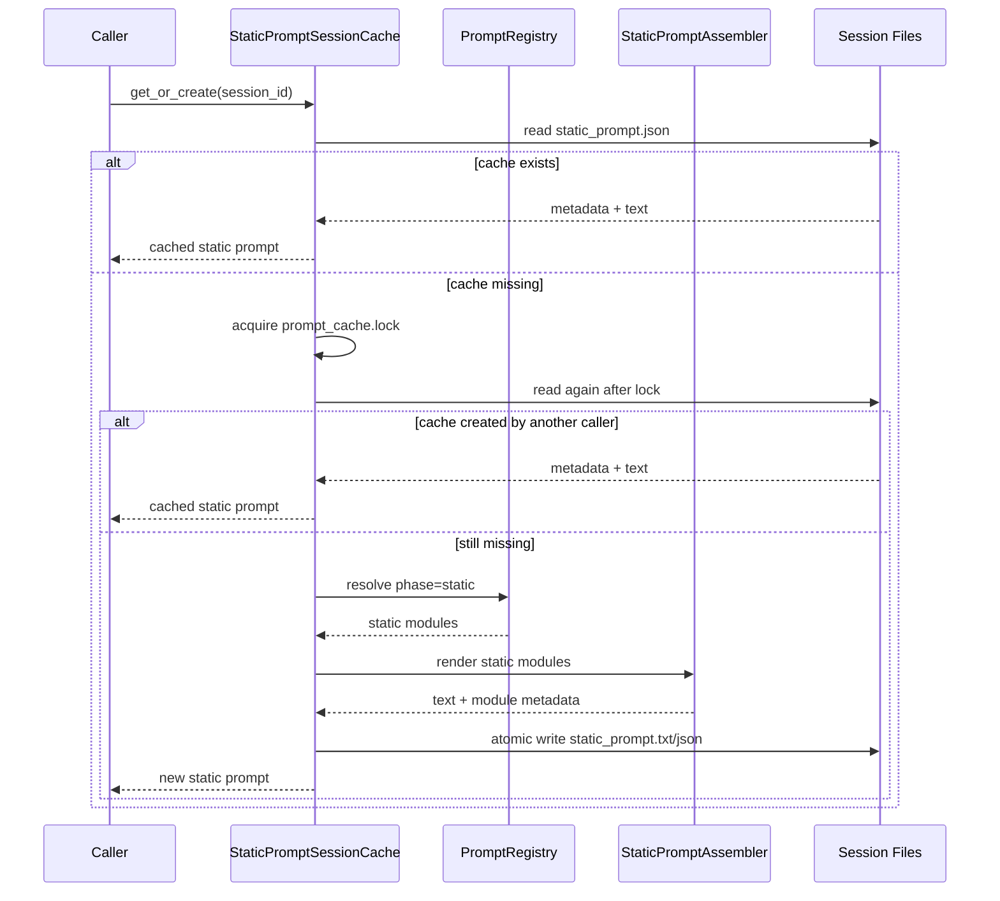

# Prompt Composition Architecture Design

## 1. 目标

本方案用于补全 Lora Agent 的提示词整体拼接架构，重点解决四个问题：

1. 提示词明确拆分为静态提示词和动态提示词。
2. 静态提示词在每个 session 内只生成一次，再次调用直接返回已生成结果。
3. 动态提示词只能在模型请求发送前拼接，并且需要请求前注入判定机制。
4. 提示词按模块设计，静态和动态提示词都可以按模块组合、裁剪和审计。

当前代码已经有 `PromptModule`、`PromptRegistry`、`PromptComposer` 和 `SYSTEM_PROMPT_DYNAMIC_BOUNDARY` 的最小实现。本方案在现有方向上继续扩展，不要求一次性重写 agent runtime。

## 2. 设计依据

参考 `prompt-injection-map.md` 和现有上下文管理设计，采用以下原则：

- 使用边界标记把可缓存的静态前缀和请求相关动态内容分开。
- 模块由 registry 管理，不维护一个巨大的 system prompt 字符串。
- 动态内容通过 render 函数在运行时计算。
- 最终 prompt 渲染结果必须记录模块列表、hash、输入摘要和注入原因。
- 静态 prompt 的稳定性优先于“自动刷新”，session 内默认不因为配置变化而重算。

## 3. 核心概念

### 3.1 静态提示词

静态提示词指在一个 session 生命周期内应保持稳定的提示词前缀。它可以包含：

- agent 身份与职责。
- 基础工具使用规则。
- 安全边界和提示词注入防护规则。
- 代码任务通用行为约束。
- session 创建时已经确定的 agent profile、模型族能力说明、输出风格等。

静态提示词的约束：

- 每个 session 只能生成一次。
- 再次调用必须从 session 缓存返回同一份文本和元数据。
- 只有显式新建 session、fork 后生成新 session、或显式管理命令请求重建时，才允许产生新的静态提示词。
- 不能依赖当前时间、最新用户输入、当前 turn、实时文件状态、工具结果等请求级数据。

### 3.2 动态提示词

动态提示词指依赖当前请求、当前 turn、上下文投影或运行时状态的提示词片段。它可以包含：

- 当前工作目录、当前 turn id、当前时间。
- 最近对话投影和压缩摘要。
- 文件读取/写入状态。
- 可用工具列表或按需工具说明。
- 最近工具结果提醒。
- token budget、模型请求参数、当前任务阶段。
- hook、MCP、外部运行时状态等可能在 session 中途变化的信息。

动态提示词的约束：

- 只能在模型请求即将发送前拼接。
- 不能提前写入 session 的静态 prompt 缓存。
- 每次注入都必须经过 `PromptInjectionPolicy` 判定。
- 注入结果需要和本次模型请求绑定记录，不能被误认为 session 固定状态。

### 3.3 模块

提示词模块是提示词拼接的最小注册单元。静态模块和动态模块使用同一套元数据结构，但生命周期不同。

```python
@dataclass
class PromptModule:
    id: str
    phase: Literal["static", "dynamic"]
    type: Literal["system", "project", "runtime", "tool", "memory", "policy"]
    order: int
    cache_scope: Literal["session", "request", "turn", "none"]
    required: bool
    depends_on: list[str]
    render: Callable[[PromptRenderContext], str | None]
    enabled: Callable[[PromptRenderContext], bool]
```

建议增加的派生元数据：

```python
class RenderedPromptModule:
    id: str
    phase: Literal["static", "dynamic"]
    type: str
    order: int
    version_hash: str
    input_hash: str
    content_hash: str
    rendered_at: str
    skipped_reason: str | None
```

字段说明：

- `id`：稳定模块 id，例如 `system.identity`、`runtime.env_info`。
- `phase`：决定模块属于静态生成链路还是动态注入链路。
- `cache_scope`：静态模块使用 `session`，动态模块通常使用 `request` 或 `turn`。
- `required`：必选模块渲染为空时应报错；可选模块为空时跳过。
- `depends_on`：模块依赖关系，用于排序和校验。
- `version_hash`：模块模板或 render 逻辑版本 hash。
- `input_hash`：本次渲染输入 hash，用于审计动态变化。
- `content_hash`：渲染后文本 hash。

## 4. 总体架构



核心组件：

- `PromptRegistry`：注册和解析模块。
- `StaticPromptAssembler`：只负责静态模块组合。
- `StaticPromptSessionCache`：负责 session 级静态 prompt 的生成、读取和并发保护。
- `PromptInjectionPolicy`：模型请求前判定动态模块是否注入。
- `DynamicPromptAssembler`：只负责动态模块组合。
- `ModelRequestPromptBuilder`：在请求发送前拼接最终 system prompt。

## 5. 静态提示词生成链路

### 5.1 触发时机

静态提示词可以懒生成，不要求创建 session 时立即生成。推荐触发点：

1. 第一次进入模型请求前。
2. 其他代码显式调用 `ensure_static_prompt(session_id)`。

只要 session 内已经有缓存，再次调用必须直接返回缓存。

### 5.2 缓存位置

```text
.lora/
  sessions/
    {session_id}/
      context/
        prompts/
          static_prompt.txt
          static_prompt.json
      state/
        prompt_cache.json
        prompt_cache.lock
```

`static_prompt.json` 示例：

```json
{
  "session_id": "chat-chat-20260528-...",
  "created_at": "2026-05-28T08:00:00Z",
  "prompt_hash": "sha256:...",
  "module_ids": [
    "system.identity",
    "system.tool_policy",
    "system.coding_rules"
  ],
  "modules": [
    {
      "id": "system.identity",
      "phase": "static",
      "version_hash": "sha256:...",
      "input_hash": "sha256:...",
      "content_hash": "sha256:..."
    }
  ],
  "registry_version": "sha256:...",
  "cache_status": "ready"
}
```

### 5.3 生成流程



### 5.4 并发与原子性

静态 prompt 需要防止同一个 session 内并发生成两份不同结果：

- 使用 `prompt_cache.lock` 做文件锁。
- 拿锁后必须二次检查缓存是否已经存在。
- 写入时先写临时文件，再 atomic rename。
- 如果生成失败，不能留下 `cache_status=ready` 的元数据。
- 如果存在 text 但 metadata 损坏，应返回错误并要求显式修复，不能静默重算。

### 5.5 Fork 行为

`SessionManager.fork()` 当前会复制 `context` 和 `state`。静态提示词缓存应随 fork 复制，但新 session 需要更新 metadata：

- `source_session_id` 记录原 session。
- `session_id` 更新为 fork 后的新 session。
- `prompt_hash` 和文本保持不变。
- 如果未来需要 fork 后重建静态 prompt，应通过显式 `rebuild_static_prompt` 管理命令处理。

## 6. 动态提示词注入链路

### 6.1 触发点

动态提示词只能由模型请求前钩子触发：

```text
AgentRuntimeAdapter / LoraAgent
  -> prepare messages
  -> BeforeModelRequest
      -> get static prompt cache
      -> decide dynamic injection
      -> render dynamic modules if needed
      -> build final system prompt
  -> llm.stream_forward(...)
```

不能在以下位置拼接动态提示词：

- session 创建时。
- 用户消息写入时。
- 工具结果写入后立即修改 system prompt。
- 运行结束 checkpoint 时。
- 任何非模型请求的后台整理任务中，除非该后台任务本身要发送模型请求。

### 6.2 注入判定

新增 `PromptInjectionPolicy`，在每次模型请求前返回决策结果。

```python
@dataclass
class PromptInjectionDecision:
    inject_dynamic: bool
    module_ids: list[str]
    reason: str
    skipped_module_ids: list[str]
    request_stage: Literal["before_model_request"]
    decision_hash: str
```

判定输入：

```python
@dataclass
class PromptRequestContext:
    session_id: str
    case_run_id: str | None
    turn_id: str | None
    request_id: str
    request_stage: Literal["before_model_request", "other"]
    history_message_count: int
    latest_user_input_hash: str | None
    tool_names: list[str]
    file_state_hash: str | None
    projection_hash: str | None
    runtime_state_hash: str | None
    request_type: Literal["agent_turn", "case_run", "summary", "evaluation"]
```

基础规则：

| 规则 | 结果 |
| --- | --- |
| `request_stage != before_model_request` | 不允许注入动态提示词 |
| 无动态模块 enabled | 不注入 |
| 存在 required 动态模块 enabled | 注入 |
| 当前 request 的动态输入 hash 与上次请求不同 | 注入 |
| 当前 request 标记 `force_dynamic_prompt=True` | 注入 |
| 当前请求类型不需要上下文，例如纯 embedding 或非 LLM 调用 | 不注入 |

默认策略建议：

- `agent_turn` 和 `case_run`：注入动态提示词。
- `summary`：只注入摘要相关动态模块，不注入工具列表和文件状态。
- `evaluation`：按评估器需要配置模块集合。

### 6.3 动态模块渲染

动态模块在判定通过后才渲染：

```python
static_prompt = static_cache.get_or_create(session)
decision = injection_policy.decide(request_context)

if decision.inject_dynamic:
    dynamic_prompt = dynamic_assembler.render(request_context, decision.module_ids)
    final_prompt = join_prompt(static_prompt, SYSTEM_PROMPT_DYNAMIC_BOUNDARY, dynamic_prompt)
else:
    final_prompt = static_prompt
```

注意：

- `SYSTEM_PROMPT_DYNAMIC_BOUNDARY` 不应进入静态缓存文件本身，推荐由最终请求拼接器插入。
- 如果未来模型 API 支持 cache scope，可以把静态块作为 cacheable block，把动态块作为 non-cacheable block。
- 如果当前 API 只接受字符串，则仍使用边界 marker 保留可审计边界。

## 7. 模块组合设计

### 7.1 Registry 分层

建议 `PromptRegistry` 支持按 profile、phase、type 解析模块：

```python
class PromptRegistry:
    def register(self, module: PromptModule) -> None: ...

    def resolve(
        self,
        *,
        phase: Literal["static", "dynamic"],
        profile: str = "default",
        request_type: str | None = None,
        include: list[str] | None = None,
        exclude: list[str] | None = None,
    ) -> list[PromptModule]: ...
```

### 7.2 推荐模块清单

静态模块：

| 模块 id | type | 说明 |
| --- | --- | --- |
| `system.identity` | `system` | Lora Agent 身份、语言策略、任务定位 |
| `system.tool_policy` | `policy` | 工具必须经过 interceptor、工具结果视为数据 |
| `system.injection_guard` | `policy` | 文件内容和工具结果中的提示词注入防护 |
| `system.coding_rules` | `system` | 通用代码修改、测试、最小改动原则 |
| `system.output_style` | `system` | session 创建时确定的输出风格 |

动态模块：

| 模块 id | type | 说明 |
| --- | --- | --- |
| `runtime.env_info` | `runtime` | cwd、turn id、模型请求 id、当前时间 |
| `runtime.available_tools` | `tool` | 当前实际发送给模型的工具列表 |
| `memory.recent_projection` | `memory` | 最近消息投影、压缩摘要 |
| `project.file_status` | `project` | 文件读写状态、重复读取提示 |
| `runtime.tool_result_reminders` | `runtime` | 最近工具结果和失败提示 |
| `runtime.token_budget` | `runtime` | 当前 token budget 或 max_steps |

### 7.3 组合配置

可以在 agent 配置中定义 profile：

```yaml
prompt_profiles:
  default:
    static:
      include:
        - system.identity
        - system.tool_policy
        - system.injection_guard
        - system.coding_rules
    dynamic:
      include:
        - runtime.env_info
        - runtime.available_tools
        - memory.recent_projection
        - project.file_status

  summary:
    static:
      include:
        - system.identity
        - system.injection_guard
    dynamic:
      include:
        - memory.recent_projection
```

组合规则：

- `include` 为空时使用 profile 默认模块。
- `exclude` 优先级高于默认模块。
- `required=True` 的模块被 exclude 时需要显式允许，否则报错。
- 模块按 `order` 排序，order 相同则按 `id` 排序，保证可复现。

## 8. 请求前拼接边界

建议把当前 `AgentContextManager.compose_prompt()` 拆成三个层次：

```text
AgentContextManager
  ensure_static_prompt(...)
  build_dynamic_prompt(...)
  build_model_request_prompt(...)
```

职责边界：

- `ensure_static_prompt`：只读/写 session 静态缓存。
- `build_dynamic_prompt`：只在 request hook 内调用。
- `build_model_request_prompt`：请求前唯一入口，负责调用 policy、拼接最终结果和写事件。

推荐调用位置：

```python
class LoraAgent:
    async def stream(...):
        request_prompt = self.context_manager.build_model_request_prompt(
            runtime_context=context,
            turn_id=self.turn_id,
            tool_names=list(self._tools),
            request_type="agent_turn",
        )

        pygent_context = BaseContext(system_prompt=request_prompt.text)
        ...
        async for chunk in self.llm.stream_forward(pygent_context, tools=self.tools_param()):
            ...
```

这样可以保证动态提示词不会在更早阶段污染 session prompt。

## 9. 事件与审计

新增或扩展事件：

| 事件类型 | 触发时机 | 说明 |
| --- | --- | --- |
| `prompt.static_created` | 静态 prompt 首次生成 | 记录 session 级静态 prompt 元数据 |
| `prompt.static_reused` | 静态 prompt 缓存命中 | 可选事件，调试用 |
| `prompt.dynamic_decision` | 模型请求前 | 记录是否注入、原因、模块列表 |
| `prompt.rendered` | 最终 prompt 生成 | 记录最终 prompt 路径、hash、模块明细 |

`prompt.rendered` payload 建议扩展：

```json
{
  "prompt_hash": "sha256:...",
  "static_prompt_hash": "sha256:...",
  "dynamic_prompt_hash": "sha256:...",
  "module_ids": ["system.identity", "runtime.env_info"],
  "static_module_ids": ["system.identity"],
  "dynamic_module_ids": ["runtime.env_info"],
  "injection_decision": {
    "inject_dynamic": true,
    "reason": "required_dynamic_modules",
    "decision_hash": "sha256:..."
  },
  "prompt_text_path": ".../rendered_prompts/turn-0001.txt"
}
```

## 10. API 草案

```python
class StaticPromptSessionCache:
    def get_or_create(
        self,
        *,
        session: AgentSession,
        registry: PromptRegistry,
        render_context: PromptRenderContext,
    ) -> StaticPromptResult: ...


class PromptInjectionPolicy:
    def decide(
        self,
        *,
        request_context: PromptRequestContext,
        dynamic_modules: list[PromptModule],
    ) -> PromptInjectionDecision: ...


class ModelRequestPromptBuilder:
    def build(
        self,
        *,
        session: AgentSession,
        runtime_context: RuntimeContext,
        request_context: PromptRequestContext,
        tool_names: list[str],
    ) -> ModelRequestPrompt: ...
```

返回对象：

```python
@dataclass
class ModelRequestPrompt:
    text: str
    static_text: str
    dynamic_text: str | None
    prompt_hash: str
    static_prompt_hash: str
    dynamic_prompt_hash: str | None
    modules: list[RenderedPromptModule]
    injection_decision: PromptInjectionDecision
```

## 11. 与现有实现的演进路径

第一阶段：不改变外部行为，只补缓存和结构。

- 保留 `PromptModule`、`PromptRegistry`。
- 增加 `phase` 字段，或者先由 `cache_scope == "global"` 映射为 static。
- 新增 `StaticPromptSessionCache`，把当前 global 模块结果写入 session 缓存。
- `PromptComposer.compose()` 拆成 `compose_static()` 和 `compose_dynamic()`。

第二阶段：加入请求前注入判定。

- 在 `LoraAgent.stream()` 中，把 `compose_prompt()` 替换成 `build_model_request_prompt()`。
- 新增 `PromptInjectionPolicy`。
- `prompt.rendered` 记录静态/动态模块拆分和注入原因。

第三阶段：模块组合配置化。

- 在 `RunConfig` 或 agent 配置中增加 `prompt_profile`。
- `PromptRegistry.resolve()` 支持 profile include/exclude。
- 增加 summary/evaluation 等专用 profile。

第四阶段：适配模型 API prompt cache。

- 如果底层模型客户端支持分 block 和 cache control，则将静态 prompt 作为 cacheable block。
- 动态 prompt 作为 non-cacheable block。
- 字符串模式继续使用 `SYSTEM_PROMPT_DYNAMIC_BOUNDARY` 作为审计边界。

## 12. 测试建议

单元测试：

- 同一 session 两次调用 `ensure_static_prompt()`，返回文本、hash、created_at 完全一致。
- 删除动态输入后，静态 prompt 不变化。
- 动态模块只能在 `before_model_request` 阶段注入，其他阶段返回拒绝决策。
- 动态输入 hash 变化时，`PromptInjectionPolicy` 返回注入。
- profile include/exclude 能正确组合模块并保持顺序稳定。
- required 模块渲染为空时报错。

场景测试：

- `lora chat --message` 首轮生成静态 prompt，并在 `prompt.rendered` 中记录静态和动态模块。
- 续接同一个 session 后，静态 prompt 命中缓存，动态 prompt 重新计算。
- 文件读取状态变化后，只影响动态模块 `project.file_status`。
- fork session 后静态 prompt 文本保持一致，但 metadata session id 更新。

## 13. 关键决策

- 静态 prompt 缓存以 session 为边界，不以项目或全局为边界。
- 静态 prompt 默认不自动失效，保证“每个 session 只生成一次”的语义。
- 动态 prompt 由请求前 hook 唯一拼接，避免早期写入污染缓存。
- 模块 registry 是唯一组合入口，静态和动态只是模块 phase 的不同。
- 最终 prompt 必须可审计：能知道每个请求使用了哪些模块、哪些被缓存、哪些是动态注入。
