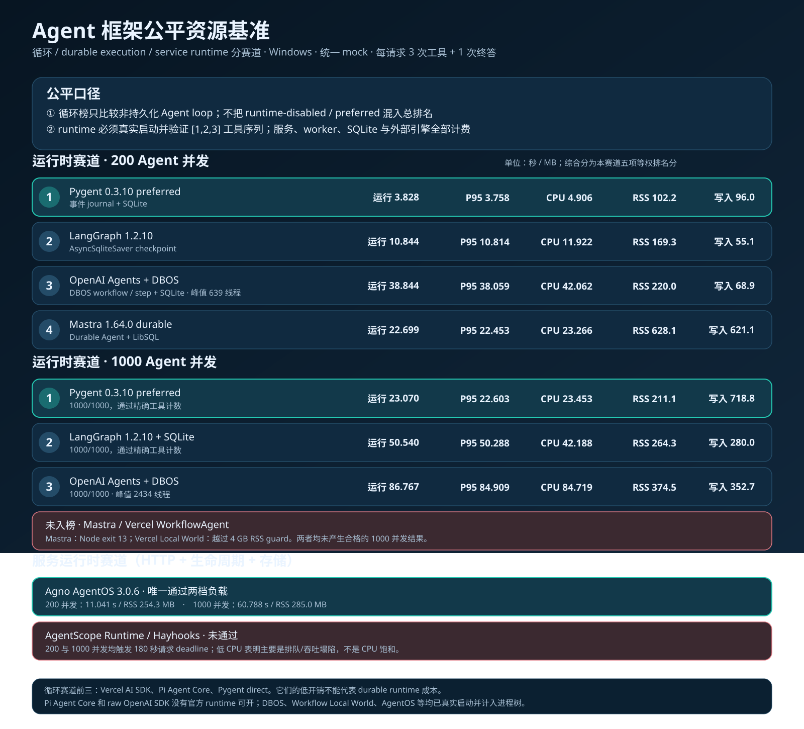

# Agent framework resource benchmark

Fresh full rerun on 2026-08-13. No performance value or ranking from an earlier run is retained in this report.

## Method

- Windows host; local OpenAI-compatible mock excluded from framework resource totals.
- Every request performs exactly three tool calls and one final answer.
- Every scenario uses three fresh-process repetitions; tables show medians.
- Short scenarios are cold (one request), serial (eight requests at concurrency one), and concurrent-8.
- High load submits 200 requests at concurrency 200: 800 model HTTP round trips and 600 tool executions per repetition.
- CPU is cumulative process-tree CPU time, not CPU percentage. RSS is peak process-tree resident memory.
- High-load qualification requires 200/200 successes in all three accepted repetitions and no resource-guard termination.
- The 4 GB RSS guard and 180-second deadline apply to high load and external framework runs.

## Short workload

| Framework / mode | Cold RSS MB | Cold CPU s | 8-conc RSS MB | 8-conc CPU s | 8-conc run s | req/s | speedup vs serial | write MB |
|---|---:|---:|---:|---:|---:|---:|---:|---:|
| vercel-ai-sdk | 65.7 | 0.219 | 74.8 | 0.297 | 0.091 | 87.97 | 2.06x | 0.001 |
| pi-agent-core | 74.4 | 0.547 | 82.9 | 0.688 | 0.198 | 40.31 | 1.61x | 0.000 |
| pygent-direct | 57.4 | 0.531 | 58.8 | 0.766 | 0.075 | 106.75 | 2.40x | 0.001 |
| pygent-runtime-disabled | 63.1 | 0.688 | 64.6 | 0.812 | 0.083 | 95.86 | 2.12x | 0.001 |
| pygent-runtime-preferred | 64.1 | 0.688 | 66.5 | 0.859 | 0.143 | 55.83 | 2.41x | 1.822 |
| mastra | 181.6 | 1.000 | 192.4 | 1.094 | 0.232 | 34.42 | 1.52x | 0.001 |
| openai-sdk | 105.4 | 2.297 | 108.1 | 1.953 | 0.602 | 13.28 | 1.33x | 0.005 |
| microsoft-agent-framework | 107.8 | 1.781 | 109.9 | 2.125 | 0.648 | 12.34 | 1.32x | 0.004 |
| agno | 118.9 | 2.141 | 121.2 | 2.156 | 0.652 | 12.27 | 1.42x | 0.004 |
| agentscope | 134.8 | 2.391 | 137.2 | 2.359 | 0.539 | 14.83 | 1.34x | 0.004 |
| haystack | 135.6 | 2.125 | 137.8 | 2.375 | 0.674 | 11.87 | 1.20x | 0.004 |
| langgraph | 136.3 | 2.391 | 138.6 | 2.453 | 0.187 | 42.67 | 1.93x | 0.005 |
| smolagents | 119.4 | 2.203 | 121.2 | 2.609 | 1.077 | 7.43 | 1.02x | 0.018 |
| openai-agents | 145.1 | 3.344 | 146.9 | 2.953 | 0.694 | 11.53 | 1.15x | 0.005 |
| pydantic-ai | 149.3 | 3.344 | 151.8 | 3.734 | 1.020 | 7.84 | 0.93x | 0.005 |
| qwen-agent | 192.3 | 2.375 | 251.4 | 4.375 | 0.951 | 8.41 | 3.31x | 0.007 |
| langchain | 140.4 | 4.047 | 141.4 | 4.812 | 0.533 | 15.01 | 1.71x | 0.005 |
| strands | 127.7 | 2.234 | 168.9 | 5.016 | 2.815 | 2.84 | 0.82x | 0.002 |
| openjiuwen | 254.9 | 5.609 | 257.6 | 5.719 | 0.963 | 8.31 | 1.14x | 0.335 |
| google-adk | 371.3 | 7.312 | 376.6 | 7.453 | 7.022 | 1.14 | 0.90x | 0.005 |
| openhands | 271.3 | 6.625 | 272.2 | 7.469 | 1.661 | 4.82 | 1.08x | 0.017 |
| llamaindex | 266.2 | 5.844 | 578.5 | 24.688 | 24.639 | 0.32 | 0.91x | 0.005 |

Pygent direct has the lowest short-workload RSS and fastest concurrent-8 run in this rerun. Vercel AI SDK uses the least CPU. Runtime disabled adds 5.8 MB RSS and 0.046 CPU-s over Pygent direct at concurrency eight. Preferred durability adds 7.7 MB RSS, 0.093 CPU-s, 0.068 seconds and 1.82 MB of writes over direct execution.

## High load: 200 concurrent agents

The score gives equal weight to run time, P95 latency, CPU, RSS and disk writes. Each metric becomes a rank percentile among the 21 qualifying entries; lower resource use is better. The function-neutral score excludes disk writes because durable journaling is not a comparable capability across frameworks.

| Rank | Framework / mode | Run s | req/s | P95 s | CPU s | RSS MB | Write MB | Score | Neutral |
|---:|---|---:|---:|---:|---:|---:|---:|---:|---:|
| 1 | vercel-ai-sdk | 0.862 | 231.9 | 0.834 | 1.656 | 163.6 | 0.026 | 92.0 | 90.0 |
| 2 | pi-agent-core | 0.993 | 201.4 | 0.988 | 1.844 | 152.0 | 0.026 | 90.0 | 90.0 |
| 3 | pygent-direct | 1.376 | 145.3 | 1.338 | 2.500 | 80.1 | 0.028 | 90.0 | 92.5 |
| 4 | pygent-runtime-disabled | 2.278 | 87.8 | 2.204 | 3.406 | 89.5 | 0.028 | 84.0 | 83.8 |
| 5 | mastra | 2.239 | 89.3 | 2.224 | 4.328 | 410.4 | 0.026 | 68.0 | 61.2 |
| 6 | openai-sdk | 2.557 | 78.2 | 2.081 | 4.125 | 152.3 | 0.036 | 66.0 | 76.2 |
| 7 | haystack | 3.281 | 61.0 | 2.474 | 5.047 | 169.3 | 0.033 | 62.0 | 63.8 |
| 8 | pygent-runtime-preferred | 2.877 | 69.5 | 2.796 | 3.781 | 89.0 | 66.072 | 62.0 | 77.5 |
| 9 | agno | 3.895 | 51.4 | 3.072 | 5.812 | 157.9 | 0.033 | 60.0 | 58.8 |
| 10 | microsoft-agent-framework | 4.005 | 49.9 | 3.170 | 5.766 | 148.2 | 0.035 | 58.0 | 60.0 |
| 11 | agentscope | 4.427 | 45.2 | 3.807 | 6.516 | 171.8 | 0.033 | 48.0 | 45.0 |
| 12 | openai-agents | 3.952 | 50.6 | 3.911 | 6.531 | 171.0 | 0.035 | 45.0 | 46.2 |
| 13 | langgraph | 3.772 | 53.0 | 3.736 | 7.031 | 175.7 | 0.035 | 44.0 | 46.2 |
| 14 | pydantic-ai | 4.465 | 44.8 | 4.394 | 6.812 | 192.2 | 0.035 | 36.0 | 33.8 |
| 15 | smolagents | 6.187 | 32.3 | 4.565 | 8.562 | 129.1 | 0.377 | 35.0 | 40.0 |
| 16 | langchain | 4.440 | 45.0 | 4.406 | 8.062 | 178.0 | 0.035 | 32.0 | 32.5 |
| 17 | google-adk | 9.849 | 20.3 | 9.838 | 10.859 | 492.3 | 0.030 | 28.0 | 16.2 |
| 18 | openjiuwen | 10.723 | 18.7 | 9.778 | 13.844 | 297.1 | 8.222 | 16.0 | 18.8 |
| 19 | strands | 35.355 | 5.7 | 34.257 | 36.531 | 859.9 | 0.031 | 15.0 | 1.2 |
| 20 | openhands | 31.226 | 6.4 | 27.643 | 34.594 | 338.1 | 0.409 | 10.0 | 10.0 |
| 21 | qwen-agent | 13.375 | 15.0 | 11.427 | 70.734 | 790.5 | 0.104 | 9.0 | 6.2 |

Pygent direct has the best function-neutral score and the lowest RSS among qualifying entries. Vercel AI SDK and Pi Agent Core lead the five-metric score because they combine the lowest wall/CPU results with slightly lower disk-write totals. Runtime preferred remains below direct and disabled because its 66.1 MB journal writes are intentionally counted, but it retains durable execution history while using only 89.0 MB RSS.

## Non-qualifying and retried runs

- LlamaIndex did not qualify: all three fresh high-load repetitions crossed the 4 GB RSS guard at 4,097-4,102 MB before completion. No older LlamaIndex high-load value is substituted.
- Strands completed 200/200 in its first two repetitions, then completed 195/200 because five requests reached its provider timeout. A clean replacement repetition completed 200/200 and is the third accepted sample. The failed repetition is retained in the raw result directory but excluded by the documented success rule.
- All other qualifying entries completed 200/200 in each of their three original fresh repetitions.

## Pygent 0.2.11 profile

Pygent 0.2.11 uses its released Rust native OpenAI-compatible transport by default. At 200 concurrency, Python `cProfile` records:

| Mode | Profile CPU s | Python calls | Main remaining Python costs |
|---|---:|---:|---|
| direct | 3.452 | 6,875,913 | JSON freeze and portable definition projection |
| runtime-preferred | 6.184 | 10,773,668 | JSON freeze/thaw, durable event encoding and Windows event-loop polling |

The Python profile no longer shows `httpx`/`httpcore` connection-pool work as a dominant hotspot. Native time is visible in process-level CPU totals but not attributed to Python functions by `cProfile`.

## Versions and limitations

Python: Pygent 0.2.11, OpenAI 2.53.0, OpenAI Agents 0.19.4, LangChain 1.3.14, LangGraph 1.2.10, Pydantic AI 2.27.0, AgentScope 2.0.6, Strands 1.51.0, Microsoft Agent Framework core 1.13.0, Agno 2.8.7, smolagents 1.26.0, LlamaIndex 0.14.23, Haystack 3.0.0, Qwen-Agent 0.0.34, Google ADK 2.6.3, OpenJiuwen 0.1.16 and OpenHands SDK 1.41.0. Node: Pi Agent Core 0.73.1, Mastra 1.57.0 and AI SDK 7.0.58.

This is a synthetic integration benchmark, not a model-quality test or production capacity guarantee. The local mock intentionally makes framework overhead visible by removing provider latency and variance. Real provider rate limits, TLS distance, token generation latency and vendor retry behavior require a separate live benchmark.
