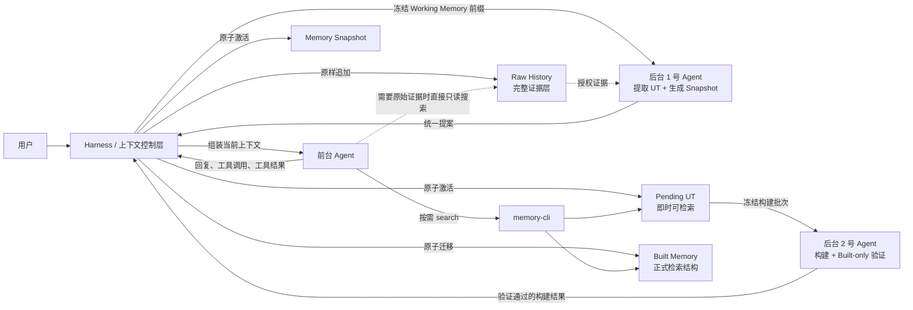
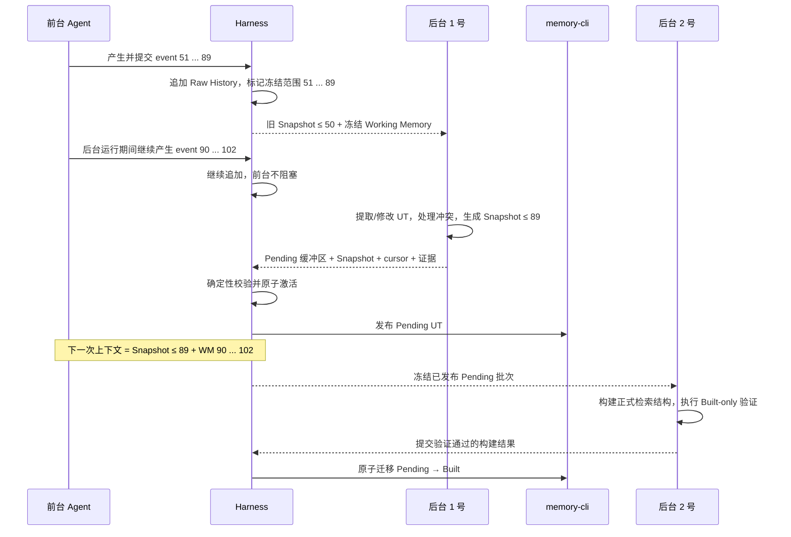
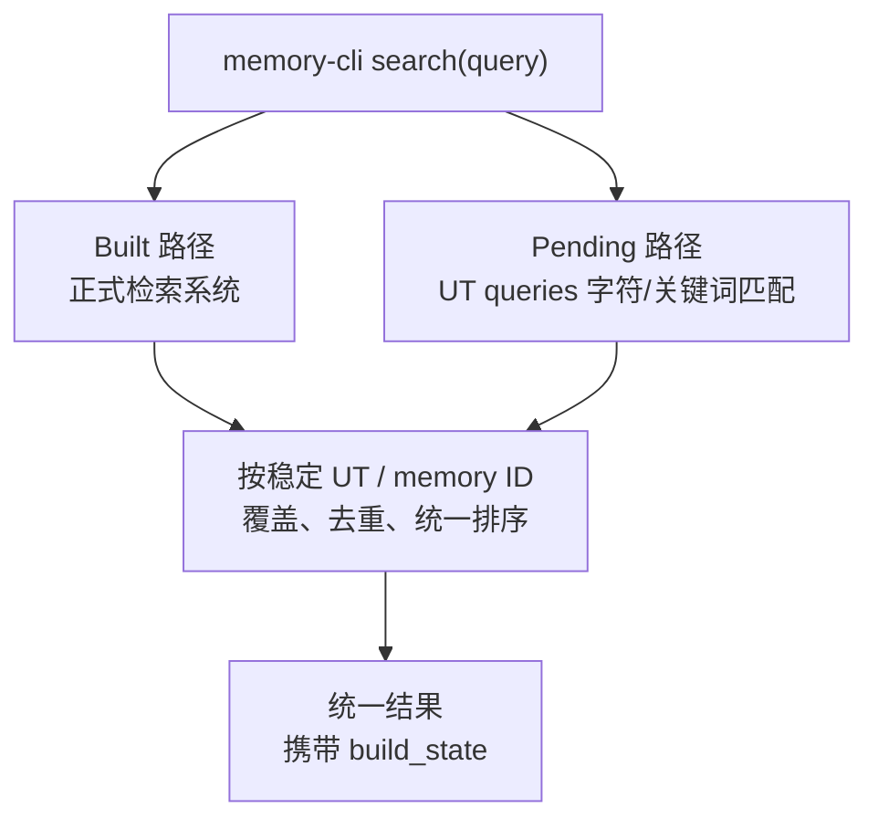
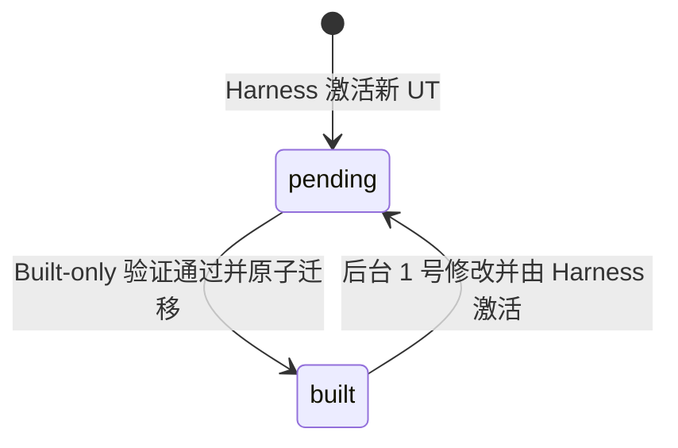

# 永续会话：为什么需要、如何工作、上下文如何变化

> 本文是永续会话特性的直观说明，不新增“第四原则”。规范性定义以[第一原则](../principles/eternal-conversation-agent.md)、[第二原则](../principles/eternal-conversation-architecture.md)和[第三原则](../principles/eternal-conversation-development.md)为准。

## 一句话说明

普通 Agent 把“当前上下文”近似当成“全部历史”；永续会话则把历史拆成有限常驻状态、可检索长期记忆和完整原始证据，让早期消息退出模型窗口后，仍然能够影响未来判断和行动。

它追求的不是复述过去，而是：

> **会话无论持续多久，Agent 都能延续完整历史形成的有效认知，在未来保持连续、一致的行为。**

## 为什么必须做

模型上下文总会遇到实际边界：

- 上下文窗口有限，会话不能无限原样拼接；
- 长历史持续增长会增加延迟、成本和注意力干扰；
- 只做摘要容易丢失精确决定、别名、承诺和约束；
- 只做检索会要求 Agent 每次都能主动想起正确的搜索词；
- 直接截断旧消息会让仍然有效的历史影响突然消失；
- 在前台同步整理全部记忆，会让用户任务被记忆维护阻塞。

因此，单纯扩大上下文、定期总结或增加向量库都不等于永续会话。完整方案必须同时解决三个问题：

1. **行为承接**：旧历史退出当前窗口前，其未来有效影响已经被可靠承接；
2. **可发现性**：关键状态自动常驻，长尾细节可以被前台 Agent 发现并查询；
3. **可追溯性**：任何摘要和记忆都能回到完整原始证据进行核对和纠错。

直观地说：**使用有限上下文和记忆系统的 Agent，应尽量像仍然看得到完整历史一样行动。**

## 四层心智模型

| 层 | 保存什么 | 是否默认进模型上下文 | 主要用途 |
|---|---|---:|---|
| Working Memory | 尚未结算的最近消息、工具调用和结果 | 是 | 继续当前工作 |
| Memory Snapshot | 已结算历史形成的有限当前状态 | 是 | 无需搜索即可保持连续行动 |
| Long-term Memory | 已发布、可检索的 UT 及记忆内容 | 否 | 查找决定、约束、承诺和历史细节 |
| Raw History | Harness 可观察到的完整原始事件 | 否 | 证据核对、纠错、重新提取 |

最重要的区别是：

```text
当前模型上下文 ≠ 完整历史

当前模型上下文
  = System Prompt
  + Memory Access Instruction
  + Memory Snapshot
  + 尚未结算的 Working Memory

完整历史
  = 持续追加且不会因上下文替换而删除的 Raw History
```

## 总体结构



### 角色权限

| 角色 | 负责什么 | 明确不负责什么 |
|---|---|---|
| 前台 Agent | 使用记忆完成用户任务 | 不整理记忆，不替换历史 |
| 后台 1 号 Agent | 提取/修改 UT，生成 Snapshot 和承接建议 | 不发布正式状态，不删除 Working Memory |
| 后台 2 号 Agent | 把 Pending UT 构建成 Built 检索结构 | 不改变记忆语义，不修改事实和约束 |
| Harness | 记录、触发、冻结、调度、代码校验、原子发布、上下文投影 | 不判断“应该记住什么”，不重新做语义总结 |
| memory-cli | 对外提供稳定检索契约和 UT 验证能力 | 不是宿主 Agent 框架 |

后台 Agent 只有提案或构建权；**正式状态激活权、历史覆盖 cursor 推进权和上下文替换权只属于 Harness。**

## 前台 Agent 实际看到什么

每次调用前台 Agent 前，Harness 按固定顺序组装：

```text
1. System Prompt
   宿主 Agent 原有身份、能力、规则和安全约束

2. Memory Access Instruction
   告诉 Agent 何时查询记忆、如何调用 memory-cli、Raw History 在哪里

3. Memory Snapshot
   已结算历史形成的有限连续状态，带 revision 和 covered-through cursor

4. Working Memory
   covered-through cursor 之后仍未结算的有序消息和执行事件
```

形式化表示为：

\[
C_t
=
P_{system}
\oplus
I_{memory\text{-}access}
\oplus
S_s^{(c)}
\oplus
W_{>c}
\]

Snapshot 是较早的历史基线。如果 Snapshot 与 cursor 更晚的 Working Memory 冲突，应以更新的 Working Memory 为准。

## 一次上下文替换是怎样发生的

下面使用固定例子说明。旧 Snapshot 已经承接到 event 50，当前 Working Memory 是 event 51 到 event 89。

### 1. 触发前

```text
前台上下文                         Harness 持久状态
┌──────────────────────┐          ┌─────────────────────────┐
│ System Prompt        │          │ Raw History: 1 ... 89   │
│ Memory Instruction   │          │ covered-through: 50     │
│ Snapshot: ≤ 50       │          │ Working Memory: 51 ... 89│
│ WM: 51 ... 89        │          └─────────────────────────┘
└──────────────────────┘
```

### 2. 在 event 89 冻结后台任务

Harness 冻结的是连续前缀 `51 ... 89`，不是停止整个会话：

```text
后台 1 号的固定输入：旧 Snapshot ≤ 50 + 冻结范围 51 ... 89

与此同时前台继续工作：
Raw History / Harness 缓存继续追加 90, 91, ... 102
```

event 90 以后不属于本次冻结范围，后台任务没有权力替换它们。

### 3. 后台 1 号提交统一提案

后台 1 号在同一次历史理解中产生：

```text
旧 Snapshot ≤ 50 + Working Memory 51 ... 89
                         │
                         ▼
                后台 1 号 Agent
                  ├── Pending UT 变更
                  ├── 新 Snapshot 候选 ≤ 89
                  ├── covered-through: 89
                  └── Raw History 证据引用
```

它还要对照当前已发布 UT 处理冲突。修改已有 Built UT 时，新内容重新成为 Pending。

### 4. Harness 原子激活

只有结构、版本、范围、证据引用、连续覆盖和 UT 契约全部合法，Harness 才一次性发布：

```text
Pending UT + Snapshot ≤ 89 + covered-through 89
```

发布成功后，下一次前台投影变为：

```text
替换前                              替换后
Snapshot ≤ 50                       Snapshot ≤ 89
Working Memory 51 ... 102    ───►   Working Memory 90 ... 102
```

Raw History 仍然完整保存 `1 ... 102`，没有任何事件被删除。替换也不会中途改写正在运行的模型调用，只影响下一次上下文投影。

### 5. 后台 2 号继续构建

此时 Pending UT 已是正式 Long-term Memory，前台可以立即搜索。后台 2 号随后把它构建进正式检索结构：

```text
Pending UT
   │ 冻结稳定 ID 和精确内容
   ▼
生成 Built 候选
   │ 关闭该批 Pending fallback
   ▼
Built-only UT 验证
   │ 通过，且内容仍未变化
   ▼
Harness 原子切换为 Built
```

这一步只优化检索表示和性能：

- 不生成新的记忆语义；
- 不改变 Snapshot；
- 不推进历史 cursor；
- 不造成检索空窗；
- 构建失败时，Pending 继续可检索。

## 完整时序



## Pending 与 Built 为什么都存在

后台构建需要时间，但历史不能因为等待构建而一直占据前台上下文。因此动态 memory-cli 提供两条检索路径：



\[
R(q)=\operatorname{Merge}(R_{built}(q),R_{pending}(q))
\]

- **Pending**：后台 1 号已经完成语义提取，并由 Harness 原子激活；可靠、正式可用，但检索较慢；
- **Built**：同一语义已经进入正式检索结构并通过 Built-only UT；检索更稳定、高效；
- 同一稳定 UT 被修改时，新 Pending 内容覆盖旧 Built 结果，不能无规则并列；
- Pending 与 Built 的目标语义一致，区别只应是检索表示、成本和性能。

UT 对业务只需要两个构建状态：



“正在构建”“构建失败”“等待重试”是任务状态，不是新的 UT 状态。

## 三个独立的版本量

系统不能把“记忆变了”“Snapshot 更新了”“历史结算到哪里”混成一个版本号：

| 状态量 | 何时变化 |
|---|---|
| Long-term Memory revision | 后台 1 号产生语义 UT 变更并由 Harness 激活时 |
| Snapshot revision | 新 Snapshot 成功发布时 |
| covered-through cursor | 一段连续 Working Memory 被可靠承接时 |

冻结范围没有值得长期保存的新信息时，UT 变更可以为空：Long-term Memory revision 不变，但 Snapshot revision 和 cursor 仍可以推进。

Pending 转 Built 只是检索表示迁移，不推进以上三个语义状态量。

## 关键技术点

### 1. 可外挂 Harness

永续会话能力挂载到存量 Agent 外部，不要求改造宿主 Agent 框架。接入方只需提供模型上下文投影、事件记录和记忆访问适配。

### 2. 原始历史只追加

上下文替换只改变模型下一次看到的投影，Raw History 永久保留，为重新提取、纠错和审计提供最终证据。

### 3. 冻结前缀，尾部继续增长

后台只处理明确的连续 cursor 范围。任务运行期间新增事件继续进入 Working Memory，避免后台延迟阻塞前台，也防止旧任务误删新消息。

### 4. 语义与提交权分离

后台 1 号判断记住什么；Harness 只做确定性的结构、身份、范围、版本、证据、连续性和 UT 契约校验。Harness 不重新总结历史。

### 5. 统一提案与原子发布

Pending UT、Snapshot 和 cursor 必须一起成功或一起失败。任何一步失败，旧 Snapshot 和完整未结算 Working Memory 继续有效。

### 6. 双通道记忆使用

- Snapshot 自动常驻，承载前台必须直接知道的有限状态；
- Long-term Memory 按需检索，承载长尾信息；
- Raw History 是两者不足时的独立证据路径。

### 7. Built-only 防止自证循环

验证 Built 候选时必须关闭对应 Pending fallback，否则 Pending 自己返回正确答案，会掩盖 Built 检索系统没有真正构建成功的问题。

### 8. 稳定 ID 与并发校验

后台 2 号冻结稳定 UT ID 和精确内容。提交前若同一 UT 已被后台 1 号修改，旧构建结果作废，新内容继续保持 Pending。

## 失败时必须保持什么

| 故障 | 前台可见结果 |
|---|---|
| 后台 1 号超时或失败 | 旧 Snapshot 继续有效，冻结范围仍留在 Working Memory |
| 提案版本过期 | Harness 拒绝提交，不推进 cursor |
| 原子发布任一步失败 | 正式状态完全不变，不出现部分替换 |
| 后台 2 号构建或验证失败 | Pending 继续可检索 |
| 构建期间 UT 被修改 | 旧 Built 候选作废，新内容保持 Pending |
| Snapshot 与更新消息冲突 | 前台以 cursor 更晚的 Working Memory 为准 |

底线是：**后台可以慢、可以失败、可以重试，但不能让前台上下文出现历史空洞。**

## 如何判断永续会话真的生效

不能只问“你还记得之前做过什么吗”。更自然的验收方式是持续进行真实工作，并在后续任务中隐含早期信息：

- 新任务悄然违反早期约束时，Agent 能主动指出冲突并询问是否覆盖；
- 只给出内部别名时，Agent 能找到别名对应的方案和边界；
- 早期决定已退出 Working Memory 后，Agent 仍能在相关开发任务中自然遵守；
- Snapshot 不足时，Agent 会主动使用 memory-cli；
- 需要原话或过程证据时，Agent 会进一步查询 Raw History；
- 记忆切换前后的任务行为保持连续，不要求用户重新解释背景。

验收关注的是未来行为连续性，而不是摘要相似度、记忆条数或单次检索分数。

## 当前项目中的实现落点

当前 Lora 初版把上述通用架构映射为：

- Harness 与后台调度：[eternal_conversation.py](../../src/lora/runtime/eternal_conversation.py)
- 前台上下文接入：[core.py](../../src/lora/runtime/agent/core.py)
- 后台模型独立配置与调用：[service.py](../../src/lora/runtime/service.py)
- 动态 memory-cli skill：`skills/dynamic-memory-cli`（由配置或安装路径挂载）
- 三份规范性文档：[docs/principles](../principles/README.md)

当前实现细节可以演进，但必须继续满足三条原则：行为连续、前后台职责分离、Harness 独占正式提交和替换权。
